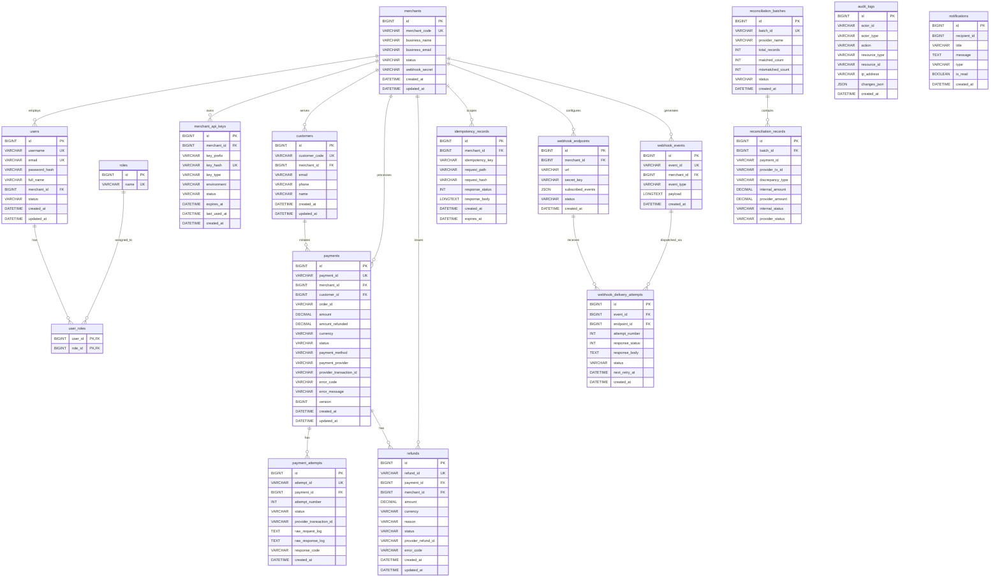

# PAYCORE — ENTITY RELATIONSHIP (ER) DIAGRAM

```mermaid
erDiagram
    users {
        BIGINT id PK
        VARCHAR username UK
        VARCHAR email UK
        VARCHAR password_hash
        VARCHAR full_name
        BIGINT merchant_id FK
        VARCHAR status
        DATETIME created_at
        DATETIME updated_at
    }

    roles {
        BIGINT id PK
        VARCHAR name UK
    }

    user_roles {
        BIGINT user_id PK,FK
        BIGINT role_id PK,FK
    }

    merchants {
        BIGINT id PK
        VARCHAR merchant_code UK
        VARCHAR business_name
        VARCHAR business_email
        VARCHAR status
        VARCHAR webhook_secret
        DATETIME created_at
        DATETIME updated_at
    }

    merchant_api_keys {
        BIGINT id PK
        BIGINT merchant_id FK
        VARCHAR key_prefix
        VARCHAR key_hash UK
        VARCHAR key_type
        VARCHAR environment
        VARCHAR status
        DATETIME expires_at
        DATETIME last_used_at
        DATETIME created_at
    }

    customers {
        BIGINT id PK
        VARCHAR customer_code UK
        BIGINT merchant_id FK
        VARCHAR email
        VARCHAR phone
        VARCHAR name
        DATETIME created_at
        DATETIME updated_at
    }

    payments {
        BIGINT id PK
        VARCHAR payment_id UK
        BIGINT merchant_id FK
        BIGINT customer_id FK
        VARCHAR order_id
        DECIMAL amount
        DECIMAL amount_refunded
        VARCHAR currency
        VARCHAR status
        VARCHAR payment_method
        VARCHAR payment_provider
        VARCHAR provider_transaction_id
        VARCHAR error_code
        VARCHAR error_message
        BIGINT version
        DATETIME created_at
        DATETIME updated_at
    }

    payment_attempts {
        BIGINT id PK
        VARCHAR attempt_id UK
        BIGINT payment_id FK
        INT attempt_number
        VARCHAR status
        VARCHAR provider_transaction_id
        TEXT raw_request_log
        TEXT raw_response_log
        VARCHAR response_code
        DATETIME created_at
    }

    idempotency_records {
        BIGINT id PK
        BIGINT merchant_id FK
        VARCHAR idempotency_key
        VARCHAR request_path
        VARCHAR request_hash
        INT response_status
        LONGTEXT response_body
        DATETIME created_at
        DATETIME expires_at
    }

    refunds {
        BIGINT id PK
        VARCHAR refund_id UK
        BIGINT payment_id FK
        BIGINT merchant_id FK
        DECIMAL amount
        VARCHAR currency
        VARCHAR reason
        VARCHAR status
        VARCHAR provider_refund_id
        VARCHAR error_code
        DATETIME created_at
        DATETIME updated_at
    }

    webhook_endpoints {
        BIGINT id PK
        BIGINT merchant_id FK
        VARCHAR url
        VARCHAR secret_key
        JSON subscribed_events
        VARCHAR status
        DATETIME created_at
    }

    webhook_events {
        BIGINT id PK
        VARCHAR event_id UK
        BIGINT merchant_id FK
        VARCHAR event_type
        LONGTEXT payload
        DATETIME created_at
    }

    webhook_delivery_attempts {
        BIGINT id PK
        BIGINT event_id FK
        BIGINT endpoint_id FK
        INT attempt_number
        INT response_status
        TEXT response_body
        VARCHAR status
        DATETIME next_retry_at
        DATETIME created_at
    }

    reconciliation_batches {
        BIGINT id PK
        VARCHAR batch_id UK
        VARCHAR provider_name
        INT total_records
        INT matched_count
        INT mismatched_count
        VARCHAR status
        DATETIME created_at
    }

    reconciliation_records {
        BIGINT id PK
        BIGINT batch_id FK
        VARCHAR payment_id
        VARCHAR provider_tx_id
        VARCHAR discrepancy_type
        DECIMAL internal_amount
        DECIMAL provider_amount
        VARCHAR internal_status
        VARCHAR provider_status
    }

    audit_logs {
        BIGINT id PK
        VARCHAR actor_id
        VARCHAR actor_type
        VARCHAR action
        VARCHAR resource_type
        VARCHAR resource_id
        VARCHAR ip_address
        JSON changes_json
        DATETIME created_at
    }

    notifications {
        BIGINT id PK
        BIGINT recipient_id
        VARCHAR title
        TEXT message
        VARCHAR type
        BOOLEAN is_read
        DATETIME created_at
    }

    merchants ||--o{ users : "employs"
    merchants ||--o{ merchant_api_keys : "owns"
    merchants ||--o{ customers : "serves"
    merchants ||--o{ payments : "processes"
    merchants ||--o{ refunds : "issues"
    merchants ||--o{ idempotency_records : "scopes"
    merchants ||--o{ webhook_endpoints : "configures"
    merchants ||--o{ webhook_events : "generates"

    users ||--o{ user_roles : "has"
    roles ||--o{ user_roles : "assigned_to"

    customers ||--o{ payments : "initiates"

    payments ||--o{ payment_attempts : "has"
    payments ||--o{ refunds : "has"

    webhook_events ||--o{ webhook_delivery_attempts : "dispatched_via"
    webhook_endpoints ||--o{ webhook_delivery_attempts : "receives"

    reconciliation_batches ||--o{ reconciliation_records : "contains"
```
